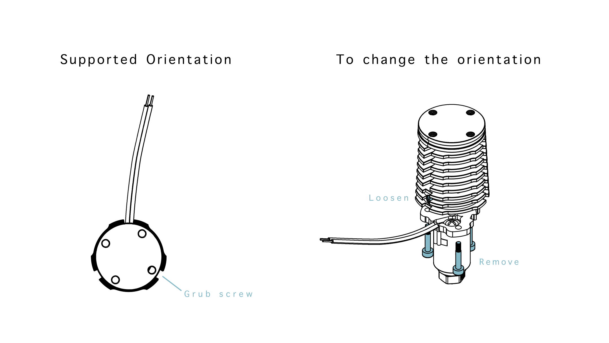

### A note about Rapido orientations

Depending on where the Rapido is sourced, it may come in one of two unsupported heatsink orientations.

To change the orientation of heatsink, first loosen the grub screw on the side and then remove the 3 screws around the heater core. The heatsink can then be rotated +/- 120° into the correct orientation. Be careful not to over-tighten the screws when reassembling as this could cause the heatbreak to bend.

