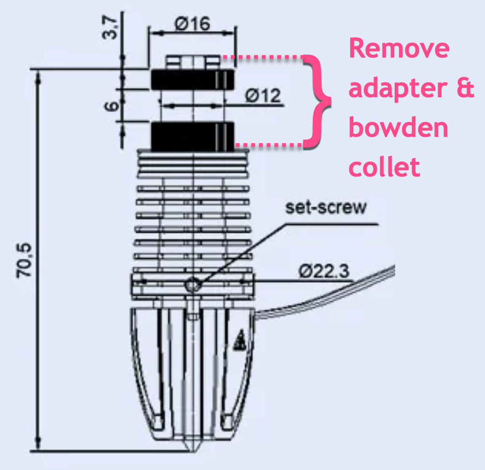

## Phaetus Rapido High Flow mount

### BOM

- One front printed part
- One rear printed part
- Heatset inserts
- Four M2.5x8 socket screws, which should be provided in your Rapido kit
- Two M3x12 socket screws
- PTFE tube

### Instructions

- Add two heatset inserts on the front printed part. Add an additional two if you plan to use the ADXL PCB mount.
- Remove the adapter and bowden collet from the Rapido's heatsink by unscrewing the two M2.5x5 screws:
  
- Place the hotend in the front printed part and secure it by screwing two M2.5x8 screws into the heatsink.
- Secure the front and rear printed parts together with two M3x12 screws.
- Secure the hotend with the rear part by screwing two M2.5x8 screws into the heatsink.
- Insert the PFTE tube at the top of the mount.

### A note about Rapido orientations

Depending on where the Rapido is sourced, it may come in one of two _unsupported_ heatsink orientations.

To change the orientation of heatsink to a supported orientation:

1. Loosen the grub screw on the side.
2. Remove the 3 screws around the heater core.
3. Rotate the heatsink +/- 120° into the correct orientation (see the pictures below).
4. Install and _gently tighten_ the 3 screws around the heater core.
5. _Gently tighten_ the side grub screw.
6. **Be careful not to over-tighten any screws when reassembling.**  Over-tightening can cause the heatbreak to bend and potentially restrict the filament path. Checking for smooth filament movement through a cold hotend without a nozzle is recommended prior to reinstalling the Rapido into the printhead.

