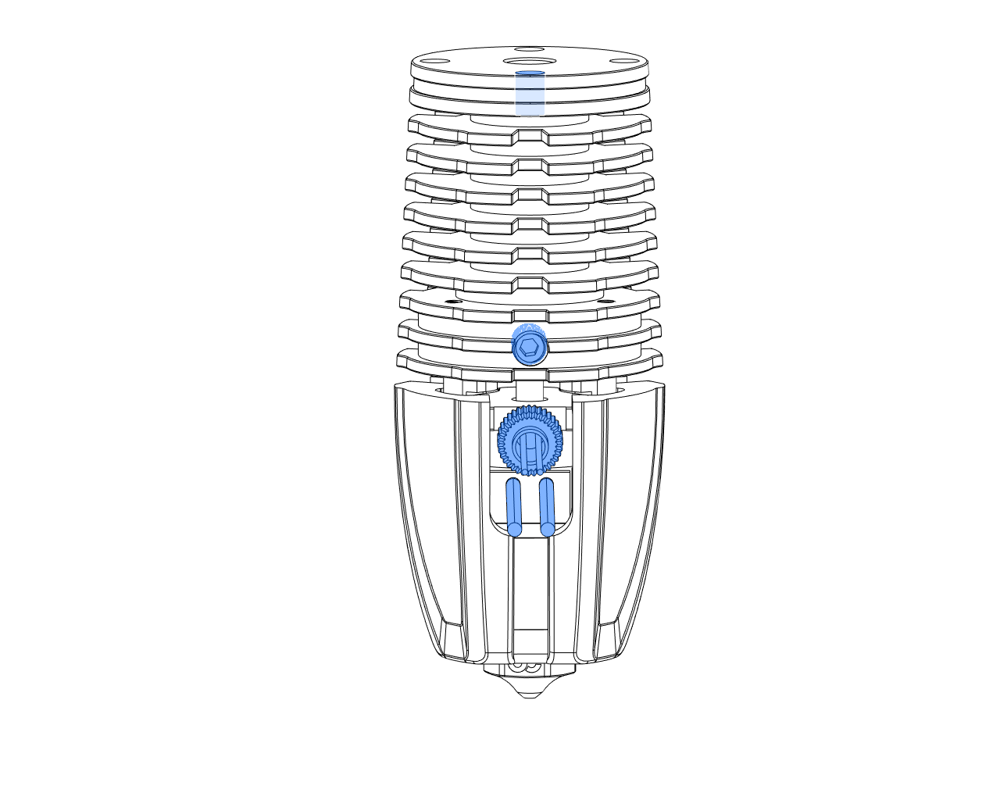
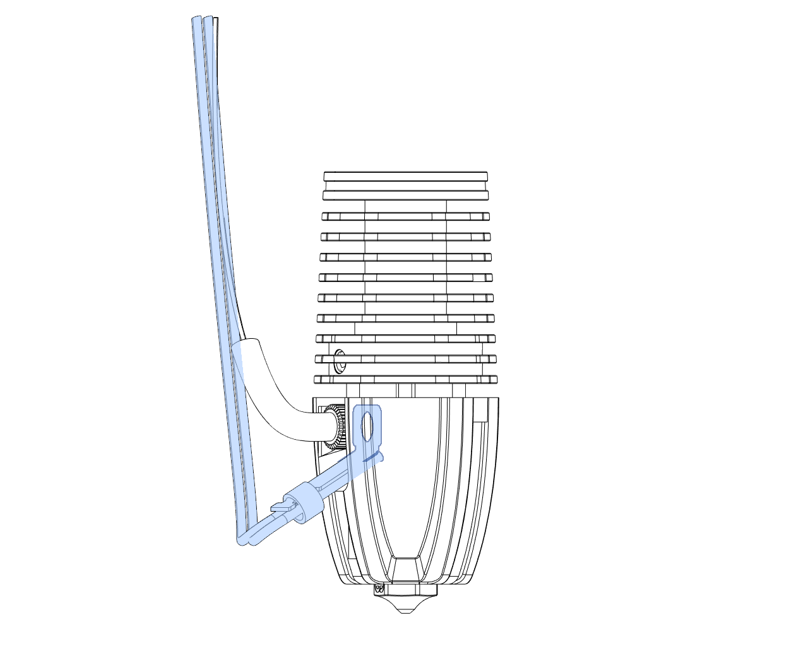
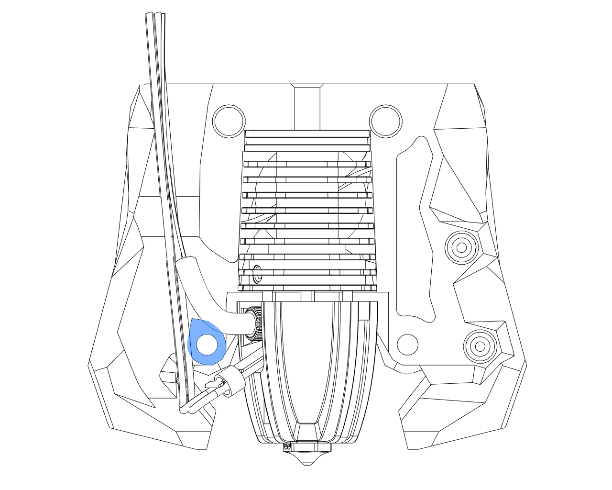

## Phaetus Rapido High Flow mount

### BOM

- One front printed part
- One rear printed part
- Heatset inserts
- Four M2.5x8 socket screws, which should be provided in your Rapido kit
- Two M3x12 socket screws
- PTFE tube

### Instructions

- Add two heatset inserts on the front printed part. Add an additional two if you plan to use the ADXL PCB mount.
- Remove the adapter and bowden collet from the Rapido's heatsink by unscrewing the two M2.5x5 screws:
  
- Place the hotend in the front printed part and secure it by screwing two M2.5x8 screws into the heatsink.
- Secure the front and rear printed parts together with two M3x12 screws.
- Secure the hotend with the rear part by screwing two M2.5x8 screws into the heatsink.
- Insert the PFTE tube at the top of the mount.

### A note about Rapido orientations

Depending on where the Rapido is sourced, it may come in one of two _unsupported_ heatsink orientations.

To change the orientation of heatsink to a supported orientation:

1. Loosen the grub screw on the side.
2. Remove the 3 screws around the heater core.
3. Rotate the heatsink +/- 120° into the correct orientation (see the pictures below).
4. Install and _gently tighten_ the 3 screws around the heater core.
5. _Gently tighten_ the side grub screw.
6. **Be careful not to over-tighten any screws when reassembling.**  Over-tightening can cause the heatbreak to bend and potentially restrict the filament path. Checking for smooth filament movement through a cold hotend without a nozzle is recommended prior to reinstalling the Rapido into the printhead.

**The following is an example for the Rapido V1 hotend, but the process is the same for the V2. Take care to ensure you are using the correct orientation for the V2, the following image just explains the process.**

Use the above process to adjust the heatsink orientation for the V2. Be sure that the heatbrake set screw, thermistor wires, and heater wires are all aligned as shown below:

After you've aligned the heatsink as shown above, you will need to slightly bend the heater wire strain relief tab (if any) downward.

After bending the heater wires downward, fit the Rapido V2 into the front half of the SB ducts, and check to make sure you've got the heater wires routed below the mounting screw boss, and the thermistor wires routed above the mounting screw boss as shown here:

Now install the back half of the SB ducts, and you are done!
